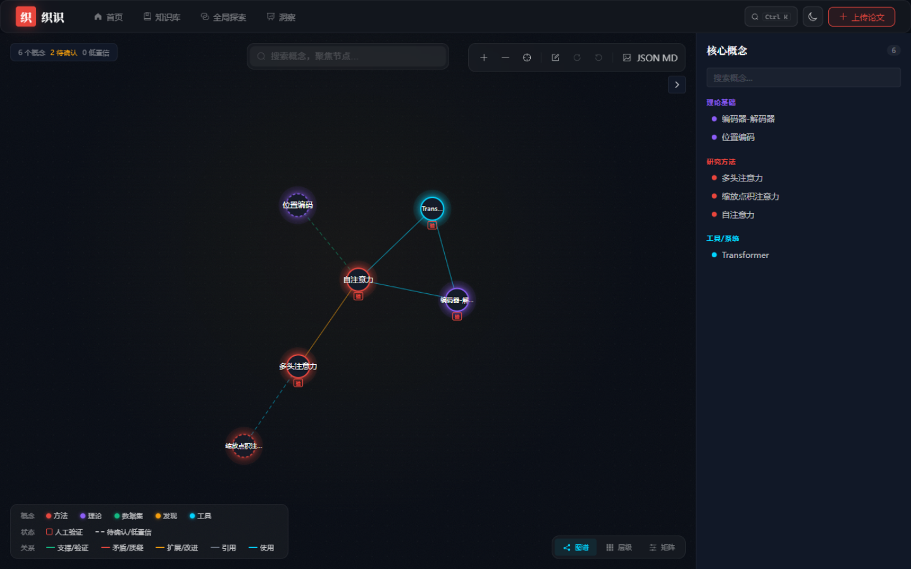
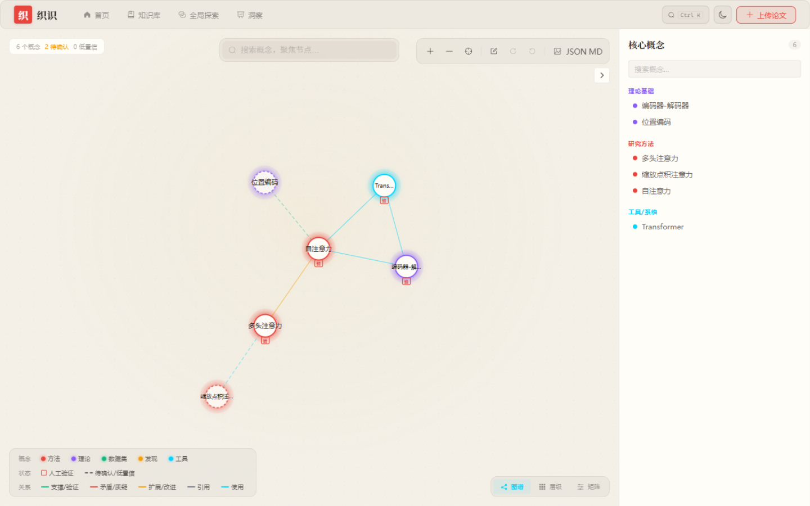
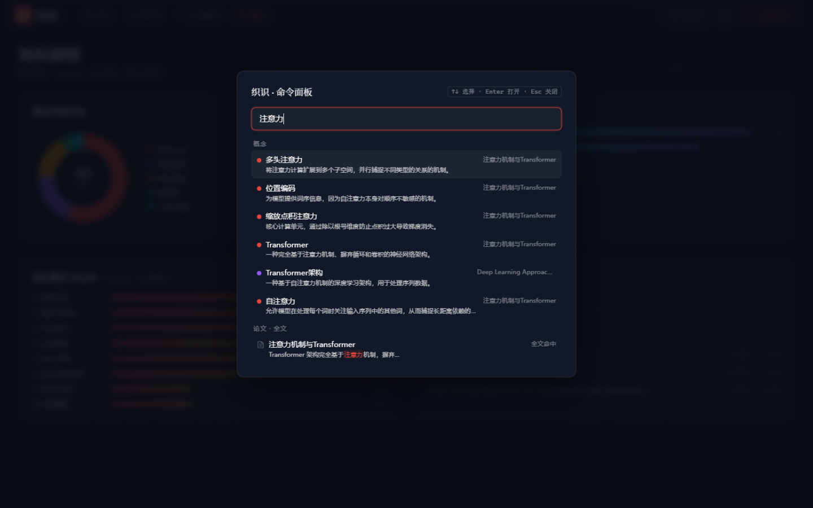
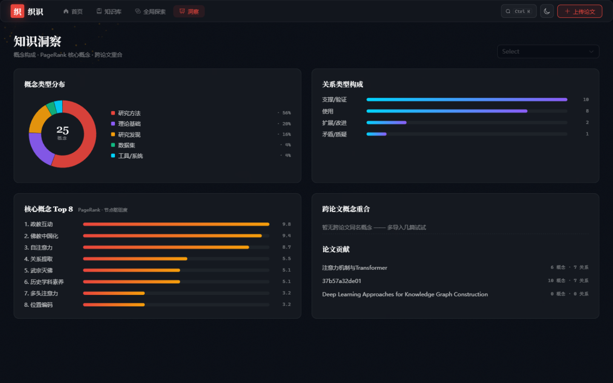
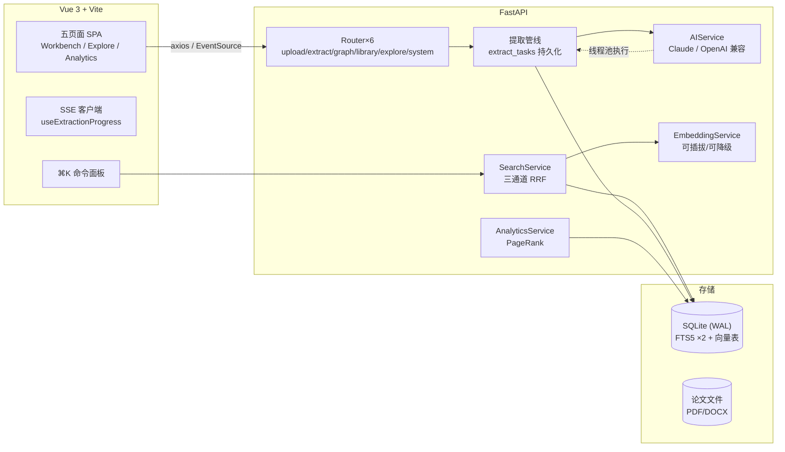

<div align="center">


# 织识 Weave · 学术知识重构引擎

**上传论文 → AI 提取概念与关系 → 编织为可交互、可验证、可导出的知识网络**

</div>

**区别于 ChatPDF 类问答产品：织识不做对话，专注把散落的文献重构为结构化知识。**
面向学术阅读与科研场景：文献综述、跨论文概念对齐、个人知识体系沉淀。


| 工作台 · 墨夜主题 | 工作台 · 宣纸主题 |
| --- | --- |
|  |  |

| 全局命令面板（⌘K） | 知识洞察 |
| --- | --- |
|  |  |

---

## 核心能力

### 🧠 可信 AI 提取
上传 PDF / DOCX、粘贴文本或网页链接，AI 提取核心概念（方法/理论/数据集/发现/工具）与关系（支撑/矛盾/扩展/引用/使用）。每条概念附带**原文证据**与**交叉置信度**（AI 自评 × 文本信号几何平均），以「待确认 → 确认/驳回」的审校工作流闭环，确认节点盖「验」字印章。

### 🔑 自带 API Key（BYOK）
内置设置页一键切换 **DeepSeek / 智谱 GLM / Kimi / 通义 Qwen / 硅基流动 / Claude / 自定义 OpenAI 兼容端点**——填入自己的 Key 即可，AI 成本归用户、部署者零支出。Key 仅保存在本机 SQLite（不上传任何服务器），修改即时生效无需重启；连接测试一键验证；可选配置 embedding（智谱 embedding-3 / 硅基流动 bge-m3）点亮语义检索。

### 📡 实时提取管线
提取任务持久化于数据库，阶段化真实进度（解析 → 切分 → 逐段提取 i/n → 置信度 → 建图）经 **SSE** 实时推送前端，断连自动降级轮询；进程重启自动恢复遗留任务，失败一键重试。

### 🔍 混合检索
**三通道召回 + RRF 融合排序**：概念关键词（FTS5 trigram 中文子串）⊕ 论文正文全文检索（snippet 高亮）⊕ 语义向量召回（可插拔 embedding，未配置自动降级）。⌘K 全局命令面板随处可呼，概念/全文/导航动作分组直达。

### 🌐 跨论文融合
多论文图谱按概念名合并生成融合视图，来源论文描边着色；实体对齐建议（精确同名 + bigram + 向量余弦精排）辅助跨源合并。

### 📊 知识洞察
类型分布环图、关系构成、**PageRank 核心概念 TopN**（跨论文同名聚合）、跨论文概念重合度——纯 SVG 手写图表，零图表库依赖。

### 🎴 双主题设计系统
「墨夜」暗色深空 + 霓虹发光 /「宣纸」暖纸墨字双主题，设计令牌前后端单一来源（`design/tokens.js` ↔ `domain_constants.py`），D3 图谱运行时取主题色。

### 🎓 学习闭环导出
知识图谱 JSON / Markdown 摘要 / **Anki 卡片包（.apkg）** 一键导出，卡片含定义、原文证据与关联关系，从文献阅读到记忆复习。

---

## 架构



## 快速开始

### 方式一：Docker（推荐）

```bash
# 配置 AI Key（可选：不配置也能跑，仅 AI 提取不可用）
export AI_PROVIDER=openai            # 或 anthropic
export AI_API_KEY=sk-xxx
export AI_MODEL=deepseek-chat

docker compose up --build
# 打开 http://localhost:8000
```

### 方式二：源码运行

依赖：Python 3.11+ / Node 18+

```bash
# 后端
cd backend
pip install -r requirements.txt
cp .env.example .env            # 填入 AI_API_KEY 等
python -m uvicorn main:app --port 8000

# 前端（另开终端）
cd frontend
npm install
npm run dev                     # http://localhost:3000，/api 代理至 8000
```

**灌入演示数据**（离线，无需 AI Key，幂等）：

```bash
cd backend && python scripts/seed_demo.py
```

### 方式三：桌面版（Windows）

```bash
build.bat        # npm build + PyInstaller onedir → backend/dist/织识/织识.exe
```

双击 `织识.exe`：**原生窗口**（WebView2）打开应用，朱砂「织」应用图标 + 任务栏名称；
单实例锁 + 端口探测 + 启动自动恢复上次浏览的页面；数据存于 `%APPDATA%\织识`。
WebView2 不可用时自动回退系统浏览器；`织识.exe --browser` 可强制浏览器模式。

---

## 技术亮点（答辩视角）

| 主题 | 细节 |
| --- | --- |
| **异步不阻塞** | LLM 调用与 PDF/DOCX 解析经 `asyncio.to_thread` 执行，长提取期间事件循环保持响应（有专门的并发响应性测试） |
| **任务持久化** | 提取任务入 SQLite（阶段/进度/错误），重启可恢复、失败可重试——区别于内存 dict 方案 |
| **SSE 实时推送** | 快照 diff + 心跳 + 终态自关闭；客户端断连自动降级轮询，两级容错 |
| **RRF 混合检索** | 三通道召回 + Reciprocal Rank Fusion（k=60），对异构分数量纲不敏感；`snippet()` 高亮转义防注入 |
| **可信抽取链路** | 证据串原文定位（模糊匹配+页码推断）→ 置信度 = √(AI 自评 × 文本信号) → 人工确认/驳回 → 印章视觉闭环 |
| **可降级设计** | embedding 未配置时：语义通道跳过、merge 精排回退 bigram、检索仍可用——全链路无硬依赖 |
| **设计系统** | 类型/关系/状态色板前后端单一来源；组件零硬编码色值；SVG 图表几何纯函数化 |
| **工程质量** | 146 个测试（后端 90 + 前端 56）全绿；ruff lint；CI 双流水线；request-ID 日志链路 |

## 测试

```bash
# 后端（90 个测试）
cd backend && python -m pytest tests/ -q

# 前端（56 个测试）
cd frontend && npm test
```

## 项目结构

```
├── backend/                 # FastAPI
│   ├── main.py              # 入口：路由挂载 / CORS / 静态托管 / SPA fallback
│   ├── logging_setup.py     # 日志 + RequestID 中间件
│   ├── database.py          # SQLite：DDL / FTS5 / 幂等迁移
│   ├── routers/             # extract / graph / library / explore / system / upload
│   ├── services/            # 提取管线 / 混合检索 / 置信度 / 证据定位 / Anki 导出 …
│   ├── scripts/             # seed_demo 演示数据 · make_icon 图标生成
│   ├── assets/weave.ico     # 应用图标（任务栏/exe/窗口）
│   └── tests/               # 90+ 测试
├── frontend/                # Vue 3 + Vite + Element Plus + D3
│   └── src/
│       ├── design/tokens.js # 设计令牌单一来源
│       ├── composables/     # 主题切换 / SSE 进度 / 错误处理
│       ├── views/           # 首页 / 知识库 / 导入 / 工作台 / 探索 / 洞察
│       └── components/      # 图谱引擎 / 命令面板 / Markdown 编辑器 …
├── docs/
│   ├── DEVELOPMENT.md       # 开发指南：扩展任务改动清单 + 工程纪律
│   └── superpowers/         # 设计 spec 与实施 plan
└── Dockerfile               # 多阶段构建（node build → python 运行）
```

## 配置说明

> **推荐**：启动后进入「设置」页直接填 Key（图形界面、即时生效、支持国产模型预设）。
> 以下环境变量作为**出厂默认**，设置页未覆盖时生效：

| 环境变量 | 说明 | 默认 |
| --- | --- | --- |
| `AI_PROVIDER` | `anthropic` 或 `openai`（DeepSeek 等兼容接口） | `anthropic` |
| `AI_API_KEY` | AI 提供方密钥 | — |
| `AI_MODEL` | 模型名 | 按 provider 自动 |
| `AI_EMBEDDING_BASE_URL/KEY/MODEL` | 可选语义检索 embedding | 空（自动降级） |
| `WEAVE_DATA_DIR` | 数据目录（DB + 论文 + 日志） | `backend/storage` |

## 已知边界

- 单用户本地应用定位：无认证体系（安全投入集中在 SSRF 防护、CORS 白名单、输入校验与请求日志）
- BYOK 的 API Key 以明文存于本地 SQLite（与 `.env` 同级，不上传）；设置接口仅掩码回显，如需加密存储可作为后续迭代
- 单进程 SQLite：任务表不支持多 worker 部署；向量检索为内存余弦扫描（万级概念内够用）
- URL 抓取存在 DNS rebinding 理论窗口（解析与请求分离），本地单用户场景可接受，代码有注释标注
- 桌面启动器（`run.py`）使用了 `msvcrt`，仅支持 Windows

## License

[MIT](LICENSE)
